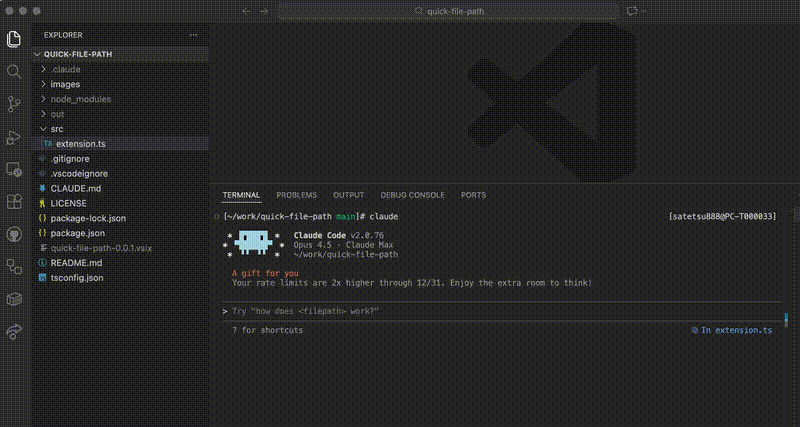

# Quick File Path

Quickly send file paths to the terminal.



## Features

- **Send Active File Path**: Send the relative path of the currently active editor file to the terminal
- **Send Selected File Path**: Send the relative path of the file selected in Explorer or Source Control to the terminal
- **Send Selected Text**: Send the selected text with file path and line number (e.g., `src/file.ts:L10-L20`) to the terminal

## Usage

1. Open Keyboard Shortcuts (`Cmd+K Cmd+S`)
2. Search for "Quick File Path"
3. Assign your preferred keybindings

### Recommended Keybinding Setup

```json
{
  "key": "cmd+;",
  "command": "quickFilePath.sendActiveFilePath",
  "when": "editorFocus && !editorHasSelection"
}
```

```json
{
  "key": "cmd+;",
  "command": "quickFilePath.sendSelectedText",
  "when": "editorFocus && editorHasSelection"
}
```

```json
{
  "key": "cmd+;",
  "command": "quickFilePath.sendSelectedFilePath",
  "when": "listFocus && (explorerViewletFocus || focusedView == 'workbench.scm')"
}
```

> **Note**: `sendSelectedFilePath` uses the clipboard internally, so your clipboard contents will be overwritten.
